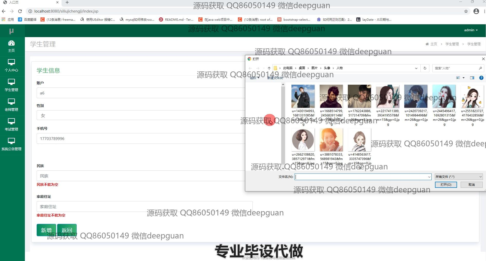
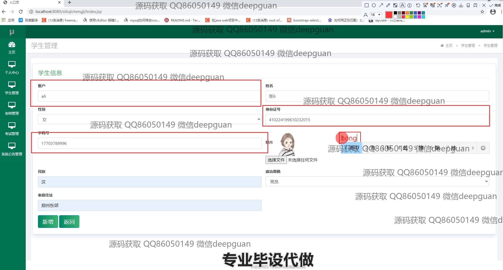
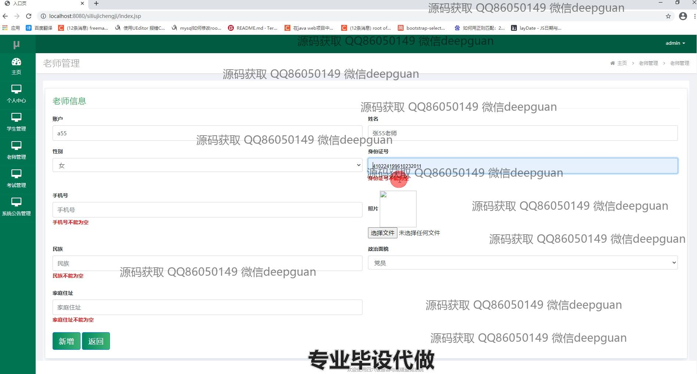
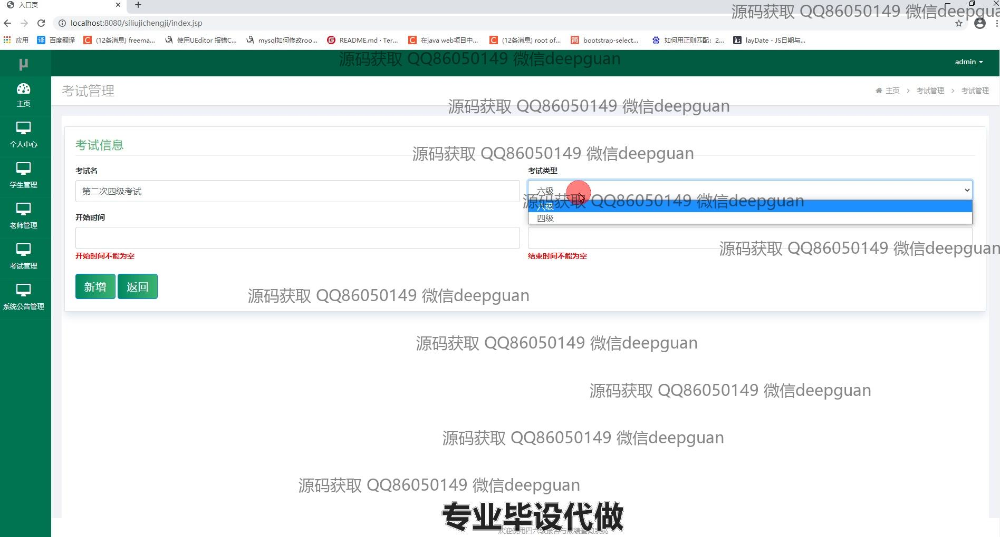
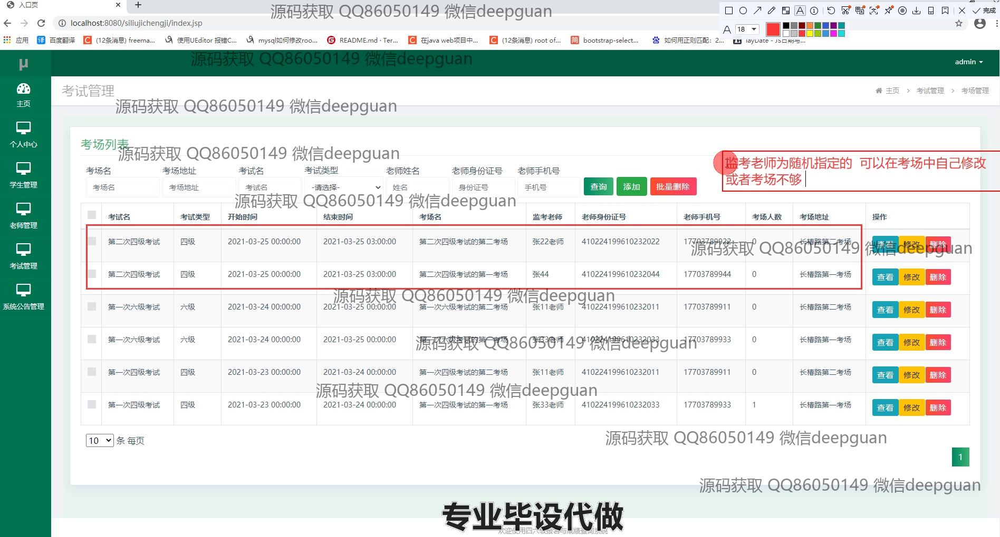
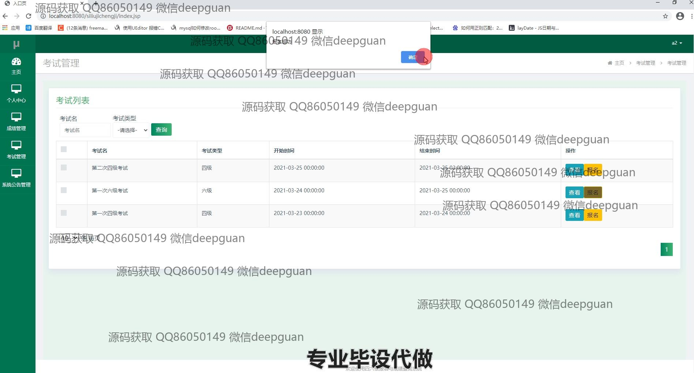
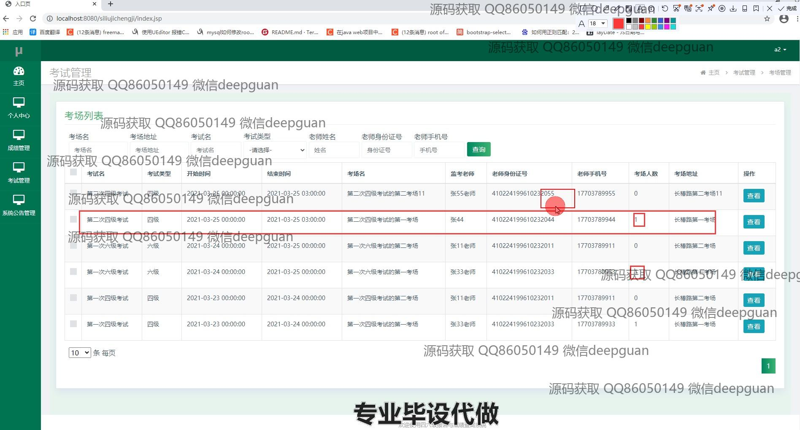

<h1 align="center">四六级报名与成绩查询系统</h1>

## 简介
四六级报名与成绩查询系统：角色分为管理员、用户；主要功能包括学生管理、教师管理、考试管理、成绩管理、考场管理及系统公告管理，提高信息管理效率与准确性。    --计算机毕业设计源码；毕设源码；java毕业设计源码

## 联系方式

<h3 align="center">获取完整代码与数据库文件 + 微信：deepguan QQ: 86050149 QQ群: 783742310</h3>

<h3 align="center">可帮忙远程部署 包运行成功！提供远程部署、修改代码、设计文档指导、代码讲解等服务！</h3>

## 功能介绍（完整见运行截图）
管理员： 管理员可以访问主页、个人中心以及各管理模块，通过系统公告管理发布、查看和管理公告内容。管理员在学生管理界面可以输入和查看学生信息，包括账户名、姓名、性别等详细资料，并可以添加新学生或编辑现有信息。管理员在考试管理界面可设置考试信息，查看考试列表并操作考试的创建、修改和删除，能够管理考试的详细信息如考试名称、类型、时间等，同时可进行考场管理，包括查看、修改、删除考场信息。在教师管理部分，管理员能够管理教师信息，上传照片，并修改教学人员的详细资料。此外，管理员可以通过功能菜单进行学生、考试、考生和公告的全面管理，提高信息的效率和准确性。

学生： 学生可以通过登录系统报名参与四六级考试，在系统中查看自己的报名信息和考试安排，并能够通过考试管理界面筛选查询所需的考试及其详细信息。除此之外，在成绩管理模块，学生可以查询自己考试的成绩信息，包括考试类型、考场信息、考试名称等。系统为学生提供了清晰明确的导航选项，使其可高效地进行操作和查询。

考生： 考生可以登录系统进行四六级考试报名，查看自己的报名信息和考试安排，通过考试管理模块了解考试名称、类型和时间等详细信息，同时能够查询和编辑个人报名信息。考生还可以在成绩管理页面跟踪考试成绩和相关信息。考生通过筛选功能能够轻松找到特定考试及其他相关信息。

教师： 教师可以通过系统查看和管理考试以及学生的信息，能够根据学校安排参与监考任务，并通过系统查看监考安排和考试细节。教师在系统中可以输入、修改个人信息，并通过考场管理功能查看指定的考场和监考任务，系统设计便于教师与管理任务的高效完成。

## 运行截图

本代码来源于网络,仅供学习参考使用!

